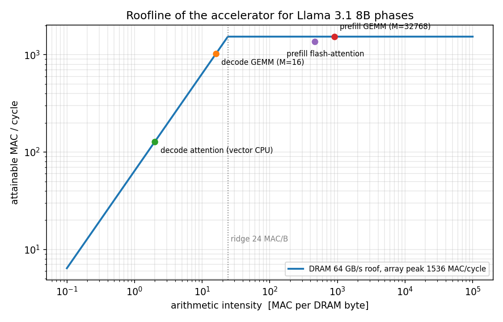

# Flash-attention and Llama 3.1 8B inference on the fixed-architecture accelerator

Technical assignment, section 2.2 — approach, methodology and results.

Everything quantitative in this document is produced by `perf_model.py` (run
`python3 perf_model.py`; the console log is in `model_output.txt`). The kernel of
task 1 is in `flash_attention_pseudocode.py`. Assumptions are numbered **A1–A15**
and collected in section 1.3; each is referenced where it matters.

---

## 0. Executive summary

| Quantity | Result | Bound by |
|---|---|---|
| Peak systolic throughput | 1 536 MAC/cycle = **3.07 TOPS** (INT8) | array SRAM ports |
| DRAM → SRAM streaming | 64 B/cycle = **64 GB/s** | two 512-bit links in series |
| Flash-attention (prefill), per layer | **226 ms**, arrays 100 %, vector CPU 38 %, DRAM 5 % | array ports (output port dominant) |
| Flash-attention (decode), per layer | **2.2 ms** (avg context 2176) | DRAM path |
| **TTFT** (16 × 2048 prompt tokens) | **≈ 157 s** (2.6 min) | compute: 2.3·10¹⁴ MACs at 3 TOPS |
| **Interactivity** | **5.3 tok/s per sequence**, 84.5 tok/s aggregate (189 ms/step) | DRAM: 7.5 GB weights + 4.6 GB KV per step |
| Bottleneck (task 2) | prefill: SRAM↔array bandwidth (elasticity −1.0, output ports −0.64); decode: DRAM path (−1.0) | |
| Two improvements (task 4) | ×4 DRAM bandwidth → 8.7 tok/s; INT4 weights + INT8 KV in DMA → 8.7 tok/s; both → 10.3 tok/s | next ceiling: array/vector ports |
| 4 accelerators (task 5) | TP = 4 for decode: **21.0 tok/s per sequence** max (336 aggregate); **≥ 0.82 GB/s per accelerator** (3.3 GB/s aggregate) for 70 % | host all-reduce |

The headline is that this accelerator is a *streaming* machine that is badly
balanced for this workload: 3 TOPS of INT8 compute behind 64 GB/s of DRAM gives a
ridge point of 24 MAC per byte. Prefill (intensity ≈ 32 768) is entirely
compute-bound and slow in absolute terms; decode (intensity = batch = 16) is entirely
memory-bound. The flash-attention kernel is designed to keep both systolic arrays
saturated in prefill and to stay off the arrays altogether in decode.

### 0.1 How the answers were derived — step by step

I treated the assignment as a performance-modelling problem first and a kernel-design
problem second, because the right kernel structure falls out of the numbers.

1. **Turn every table entry into a rate** (section 1). The spec describes the machine
   only through *port bandwidths* and *command latencies*; it deliberately gives no
   MAC/cycle for the arrays and declares the vector CPU "infinite compute". The only
   fully spec-grounded model is therefore: *every engine is a port; time on an engine =
   bytes moved ÷ port bandwidth*. The first result of this step is that the two arrays
   are worth 1 536 MAC/cycle in total and that K = 256 is the only contraction depth at
   which the 32×16 array reaches full rate.
2. **Characterise the workload in bytes and MACs** per phase (prefill vs decode) and per
   operator (GEMMs vs attention), then place every phase on a roofline against the DRAM
   path and the array peak (section 2, `roofline.png`). This step already decides the
   regimes: prefill is array-bound, decode is DRAM-bound, before any kernel exists.
3. **Derive the kernel from the array geometry** (section 3): 16/32 rows × 16 columns,
   K ≤ 256, 8-bit in / 16-bit out, `C = AᵀB` with both operands as rows of K contiguous
   bytes. Block sizes (BR = 128, BC = 256), operand layouts (K row-major, Vᵀ built on
   chip), the array split (75/25 % of Q·Kᵀ, 100 % of P·V on the 32×16) and the decode
   variant (vector CPU) are *derived* from those constraints, not picked from habit.
4. **Build one analytical model** (`perf_model.py`, dependency-free Python) that emits
   every number in this report — TTFT, decode step, elasticities by finite differences,
   the improvement variants and the 4-accelerator scaling — so that each claim is
   reproducible and each assumption is a named switch (`sa_cmd_queue`, `kv_bytes`,
   `w_bytes`, `slab_bytes`, …).
5. **Stress the assumptions that are not in the spec** (array MAC rate A2, activation
   precision A3, command queueing A7) with explicit sensitivity runs (end of section 4 and
   section 5.2) and report how far each conclusion depends on them: the
   absolute TTFT moves by up to 2×, the identity of the bottleneck and every decode
   number do not move at all.
6. **Answer tasks 2–5 from the model**, not from intuition: the bottleneck is the
   parameter with the largest measured elasticity; the improvements are the two
   variants with the largest step-time reduction *and* a look at what binds next; the
   4-accelerator result is a comparison of three sharding schemes plus a bandwidth
   budget solved from the 70 % target.

Every design decision is collected with its rejected alternatives in section 3.7.

---

## 1. Reading the architecture

### 1.1 Converting the table into engineering units

At 1 GHz one cycle is one nanosecond, so *bit/cycle ÷ 8 = GB/s*.

| Link | Given | Bytes/cycle | Comment |
|---|---|---|---|
| DRAM ↔ DMA | 512 bit/cycle | 64 | in series with the next line → 64 B/cycle end-to-end |
| DMA ↔ SRAM | 512 bit/cycle | 64 | |
| SRAM ↔ vector CPU | 1024 bit/cycle | 128 | widest port on the chip |
| SRAM → 16×16 array (inputs) | 512 bit/cycle | 64 | 8-bit elements → 64 elements/cycle |
| 16×16 array → SRAM (outputs) | 64 bit/cycle | 8 | 16-bit elements → 4 elements/cycle |
| SRAM → 32×16 array (inputs) | 768 bit/cycle | 96 | |
| 32×16 array → SRAM (outputs) | 64 bit/cycle | 8 | |

### 1.2 What the systolic arrays can actually do

A tile op streams two 8-bit operands (A^T with 16 or 32 rows, B with 16 rows, both
K deep) through the input port and one 16-bit C tile through the output port. The
assignment says the arrays are pipelined, so in steady state a tile costs
`max(input bytes / input bw, output bytes / output bw)` cycles (**A2**):

| Array | K | Input cycles | Output cycles | Cycles/tile | Useful MAC/cycle |
|---|---|---|---|---|---|
| 16×16 | 256 | 32·256/64 = 128 | 512/8 = 64 | **128** | 512 |
| 16×16 | 128 | 64 | 64 | 64 | 512 |
| 32×16 | 256 | 48·256/96 = 128 | 1024/8 = 128 | **128** | 1024 |
| 32×16 | 128 | 64 | 128 | 128 | **512** (output-bound) |

Observations that drive the whole design:

1. The numbers are chosen so that at K = 256 both arrays take exactly 128 cycles per
   tile and are perfectly balanced between input and output ports. Peak is
   512 + 1024 = **1 536 MAC/cycle**. Since neither array holds an operand stationary
   (every op re-streams both tiles), this peak is independent of tiling: it is a port
   limit, not a PE limit.
2. At K = 128 — which is exactly the head dimension, i.e. the contraction depth of
   Q·Kᵀ — the 32×16 array is *output-port bound* and drops to half rate, while the
   16×16 array stays at full rate. This asymmetry decides how Q·Kᵀ and P·V are
   assigned to the arrays (section 3.3).
3. Weight ingest capacity of the two arrays at K = 256 is 64 + 32 = **96 B/cycle**,
   but DRAM can only deliver 64 B/cycle. In decode, where each weight byte is used
   once per step, DRAM is the ceiling; if DRAM were widened, the array input ports
   become the ceiling (section 6).
4. Ridge point vs DRAM: 1 536 / 64 = **24 MAC per DRAM byte**. A GEMM with batch 16
   does 16 MAC per weight byte → memory-bound; prefill with 32 768 tokens → compute-bound.
   

### 1.3 Assumptions (documented as required by section 4 of the brief)

- **A1** Single 1 GHz clock; "bidirectional" links are full-duplex at the stated rate in each direction; no SRAM bank conflicts or bus contention (given).
- **A2** Array throughput is set by its SRAM ports as in 1.2. This implies 2 MACs per PE per cycle at K = 256. If the arrays were instead PE-bound (1 MAC/PE/cycle, ≈ K cycles per tile), all compute-bound numbers double (TTFT ≈ 315 s); decode numbers are unaffected. Reported as sensitivity.
- **A3** *Precision at the array boundary.* Activations are 16-bit but the arrays accept 8-bit inputs and emit 16-bit outputs (which already forces a re-quantisation of the 23-bit sums). I feed the arrays with **dynamically re-quantised INT8** operands: per-row scales for Q, K and P, per-(channel, 256-key block) scales for V, per-row scales for GEMM inputs (SmoothQuant / SageAttention style). 16-bit is retained for storage, residual stream, softmax statistics and the KV cache. The exact alternative (split each 16-bit value into a signed high and unsigned low byte, 2 matmuls for act×weight, 4 for act×act) doubles TTFT to ≈ 328 s and leaves decode unchanged; reported as sensitivity.
- **A4** Array outputs are int16 with a programmable right shift; the arrays cannot accumulate into an existing C tile. Partial sums over K-chunks of 256 are therefore accumulated in FP32 by the vector CPU.
- **A5** Tile commands take (base, row stride) for A, B, C, so a 16×16 or 32×16 result can be written into a larger row-major buffer.
- **A6** DMA descriptors are queued and support 2-D strided copies; the 200/150-cycle DRAM latency is paid once per descriptor and overlapped by the queue.
- **A7** The control CPU issues commands asynchronously into FIFOs; the 200/300/100-cycle communication latencies are pipeline-fill costs, paid once per phase. Sensitivity: if every 128-cycle tile op had to wait 100 cycles for its command, peak would fall to 862 MAC/cycle and the prefill attention layer would take 476 ms instead of 226 ms — this is the single most important software-visible property of the control path.
- **A8** Vector CPU: infinite compute (given), FP32 arithmetic, cost = bytes moved / 128. RMSNorm is fused into the INT8 re-quantisation pass that precedes each GEMM.
- **A9** Prefill GEMMs use 2-D tiling with an 8 MiB weight slab resident in SRAM; the INT8 copy of the activation matrix is re-read once per slab.
- **A10** Decode attention runs on the vector CPU, not the arrays (section 3.6).
- **A11** KV cache is 16-bit (per the spec), token-major `[tokens × 128]` for K and V, in DRAM. Weights are INT8, stored transposed `[N × K]`.
- **A12** Multi-accelerator: accelerators communicate only via the host interface. All-reduces are host-mediated (send partials up, host sums, send result down), on the critical path, with full-duplex links and negligible host arithmetic.
- **A13** Within a phase, DMA / arrays / vector CPU overlap perfectly (double buffering), so phase time = max of the three; phases within a layer are serialised (conservative).
- **A14** Greedy sampling; embedding lookup is a DMA gather — both negligible.
- **A15** Llama 3.1 8B: 32 layers, d = 4096, 32 query / 8 KV heads of 128, FFN 14 336 (SwiGLU), vocabulary 128 256, untied LM head → 8.03 B parameters.

---

## 2. Workload characterisation

| Item | Value | Derivation |
|---|---|---|
| Linear weights (32 layers) | 6.98 B params = 6.98 GB INT8 | per layer 4096·(4096+2·1024) + 4096² + 3·4096·14336 = 218 M |
| LM head | 0.53 B = 0.53 GB | 4096 × 128 256 |
| Weight bytes streamed per decode step | **7.50 GB → 117 ms** at 64 GB/s | every linear layer once per step |
| KV cache | 128 KiB per token | 32 layers × 2 × 8 heads × 128 × 2 B |
| KV read per decode step (avg ctx 2176) | **4.56 GB → 71 ms** | 16 sequences × 2176 tokens × 128 KiB |
| KV footprint at end | 4.8 GB | 16 × 2304 × 128 KiB — fits in 64 GiB with the 8 GB of weights |
| Prefill linear MACs | 2.29·10¹⁴ → **149 s at peak** | 6.98 G params × 32 768 tokens (+ LM head on 16 tokens) |
| Prefill attention MACs (causal) | 9.9·10¹² | 16 × 32 heads × 32 layers × 2 × (0.5625 × 2048²) × 128 |
| Decode attention MACs per step | 9.1·10⁹ | trivial — but it moves 4.56 GB |

Two regimes follow immediately: prefill is ~99 % array time, decode is ~100 % DRAM
time. Attention is 4 % of prefill MACs and 38 % of decode bytes.

---

## 3. Task 1 — Optimised flash-attention kernel

Full pseudocode: `flash_attention_pseudocode.py`. This section explains the decisions.

### 3.1 Design goals, in priority order

1. Keep **both** systolic arrays busy 100 % of the time in prefill (they are the
   scarce resource, section 4).
2. Keep the vector CPU off the critical path (it is memory-bound at 128 B/cycle and
   has to do softmax, re-quantisation and all partial-sum accumulation).
3. Load every K/V byte from DRAM **once** per layer and share it across the 4 query
   heads of a GQA group; load Q once per head.
4. Never let control-CPU latency stall an engine: everything is enqueued ahead.

The classic flash-attention motivation — S never fits on chip — barely applies here:
one head's full 2048×2048 int16 S is 8 MiB and SRAM is 16 MiB. What *does* matter is
bandwidth: S leaves the arrays through an 8 B/cycle port and must be consumed by a
128 B/cycle vector CPU. Block-wise online softmax keeps that traffic to a single pass.

### 3.2 Numerical scheme (A3, A4)

Operands fed to the arrays are re-quantised to INT8 by the vector CPU: Q per query
row, K per key row, V per (channel, 256-key block), P (probabilities in (0, 1]) as
uint8 with a fixed 1/255 scale. Output right-shifts of 6 (Q·Kᵀ over 128) and 8 (P·V
over 256) keep the 22–23-bit sums inside 16 bits with ≤ 1 bit of headroom. All
scaling, the 1/√d temperature, masking, exp, running max/sum and the FP32 output
accumulation happen on the vector CPU, whose arithmetic is free; only bytes count.

The online-softmax rescale factor α = exp(m_old − m_new) is applied at the moment the
P·V partial tile of the same block is folded into the FP32 accumulator, so it adds no
traffic beyond the read-modify-write that is needed anyway.

### 3.3 Mapping the two matmuls onto the two arrays

Both arrays compute "rows dot rows": C[i][j] = ⟨row i of Aᵀ, row j of B⟩. Hence

- **S = Q·Kᵀ**: Aᵀ = query rows (128 B), B = key rows (128 B), K = d = 128.
- **O = P·V**: Aᵀ = P rows (256 keys), B = rows of **Vᵀ** (256 keys), K = 256.

Vᵀ is produced once per (sequence, KV group) by the vector CPU while it re-quantises V
(1 MiB read, 512 KiB written, 12 k cycles amortised over 4 heads × 2048 queries).
Storing the KV cache itself transposed was rejected because the per-token append
would become 128 scattered 2-byte writes.

Because K = 128 makes the 32×16 array output-bound (512 MAC/cycle) while the 16×16
array is exactly balanced (512 MAC/cycle), and K = 256 lets the 32×16 array run at
1024 MAC/cycle, the optimal static split (solved in `split_two_arrays`) is:

- 16×16 array: 75 % of Q·Kᵀ;
- 32×16 array: 25 % of Q·Kᵀ + 100 % of P·V.

Both arrays then finish a block in the same time and the kernel sustains
**1 365 MAC/cycle = 89 % of peak** (versus 1 229 if both arrays did everything and
1 024 if the 32×16 array were left idle during Q·Kᵀ).

### 3.4 Tiling

| Parameter | Value | Why |
|---|---|---|
| Key block BC | 256 | = Kmax; one P·V op contracts an entire key block |
| Query block BR | 128 = 4 × 32 | 4 sub-tiles of 32 rows is exactly what balances the arrays (3 S sub-tiles on the 16×16, 1 S + 4 PV sub-tiles on the 32×16) |
| S sub-tile (32 q × 256 k) | 32 ops × 64 cyc (16×16) or 16 ops × 128 cyc (32×16) | 2 048 cycles either way |
| PV sub-tile (32 q × 128 d) | 8 ops × 128 cyc (32×16) | 1 024 cycles |
| Block time | **6 144 cycles** on each array | 2 × 128 × 256 × 128 × 4 = 8.4 M MACs |
| Vector traffic per block | 256 KiB → 2 048 cycles | 33 % of the block time |
| Causal blocks | 72 of 128 per head | blocks entirely above the diagonal are skipped; diagonal blocks are masked by the vector CPU |

### 3.5 SRAM allocation (prefill)

| Region | Size | Purpose |
|---|---|---|
| KV staging ×2 (16-bit K and V of one group) | 2 × 1 MiB | DMA landing, double-buffered across (b, g) |
| K8 `[2048×128]`, V8T `[128×2048]`, scales | 524 KiB | INT8 operands of the current group |
| Q staging ×2 (16-bit) | 2 × 512 KiB | DMA landing, double-buffered across heads |
| Q8 ×2 + per-row scales | 2 × 264 KiB | INT8 Q of current / next head |
| S ×2 `[128×256]` int16 | 2 × 64 KiB | array output, ping-pong per key block |
| P8 ×2 `[128×256]` uint8 | 2 × 32 KiB | vector output → 32×16 input |
| O partial ×2 `[128×128]` int16 | 2 × 32 KiB | P·V output |
| O accumulator `[128×128]` fp32, m/l/α | 66 KiB | current query block |
| O out ×2 `[128×128]` int16 | 2 × 32 KiB | normalised output, DMA to DRAM |
| **Total** | **≈ 4.4 MiB of 16 MiB** | remaining space keeps an 8 MiB weight slab resident for the surrounding GEMMs |

### 3.6 Dataflow

Loop order (outer → inner): `(sequence b, KV group g) → head h in group → query block
qi → key block kj → sub-tile`. K/V are loaded and re-quantised once per (b, g); Q once
per head; the next group's K/V and the next head's Q are prefetched by DMA while the
current ones compute (DMA is 5 % busy).

Steady state for one key block of one query block (software-pipelined by one block):

```
cycle      0         2048        4096        6144
16×16   | S(sub0,j) | S(sub1,j) | S(sub2,j) |
32×16   | S(sub3,j) | PV(sub0,j-1) PV(sub1,j-1) PV(sub2,j-1) PV(sub3,j-1) |
vector  |   softmax(sub3,j) softmax(sub0..2,j)   accumulate(sub0..3,j-1)   |   33 % busy
DMA     |   prefetch next Q / next K,V ; write back finished O blocks       |    5 % busy
```

Per layer this is 128 groups × 4 heads × 72 blocks × 6 144 cycles = **226 ms**
(arrays 100 %, vector CPU 38 % when re-quantisation and finalisation are included,
DRAM 5 %).

**Decode variant (A10).** With one query per sequence, the arrays would stream a
16-row tile for 4 useful rows (the GQA group): ≤ 128 MAC/cycle per array, ≤ 256 combined (1/6 of peak),
whereas the vector CPU reads each K/V byte once through the widest port on the chip.
The decode kernel therefore streams K and V of each (b, g) from DRAM into a
double-buffered 2 × 1.2 MiB staging area and lets the vector CPU do q·Kᵀ, softmax and
p·V in FP32 (no re-quantisation at all). It is DRAM-bound: 2.2 ms per layer at the
average context, i.e. 8 cycles of DMA per key versus 4 cycles of vector work.

### 3.7 Decision log

Every non-obvious choice in the kernel and the model, with the alternatives that were
considered and the quantitative reason for the choice.

| # | Decision | Alternatives considered | Why this one | Measured effect |
|---|---|---|---|---|
| D1 | Model the arrays by their SRAM ports only (A2) | PE-bound model (K cycles per tile) | The spec gives only ports; its numbers make K = 256 exactly balanced, which is clearly intentional | PE model would double TTFT (315 s); decode unchanged |
| D2 | Dynamic INT8 re-quantisation of every array operand (A3) | Exact hi/lo-byte split (2 matmuls act×weight, 4 act×act); FP8 interpretation | Arrays accept only 8 bits and already lose precision in the 16-bit output; INT8 with per-row scales is standard practice | Exact split → TTFT 328 s (×2.08); FP8 → identical byte counts |
| D3 | Build Vᵀ (INT8) on chip once per (b, g) | Store the KV cache transposed in DRAM | Transposed cache turns the per-token append into 128 scattered 2-byte writes | 12 k cycles per group, 0.5 % of the group's array time |
| D4 | K/V loaded once per (b, g) and shared by the 4 GQA heads; Q streamed per head | Head-outer loop (K/V reloaded per head) | Cuts K/V DRAM and re-quantisation traffic by 4× | DRAM 5 % busy instead of ~20 % |
| D5 | BC = 256 keys | 128 (would halve S buffers) | P·V contracts over keys; only K = 256 gives the 32×16 array 1 024 MAC/cycle | BC = 128 would cost 25 % of attention throughput |
| D6 | BR = 128 queries = 4 × 32-row sub-tiles | 64 / 256 | Exactly balances 3 S sub-tiles on the 16×16 against 1 S + 4 PV sub-tiles on the 32×16 | 1 365 MAC/cycle (89 % of peak) vs 1 024–1 229 for naive splits |
| D7 | Static array split (75 % / 25 % of Q·Kᵀ, 100 % of P·V on 32×16) | Dynamic work stealing; all Q·Kᵀ on 16×16 | Solved analytically (`split_two_arrays`); static is simpler for a control CPU with 100-cycle command latency | Both arrays busy 6 144 cycles per block |
| D8 | One-block software pipeline (PV of block j−1 overlaps S of block j) | Fully serial S → softmax → PV | Removes the vector CPU from the array critical path | Vector CPU 33 % busy, invisible |
| D9 | FP32 accumulator and softmax statistics on the vector CPU (A4, A8) | 16-bit accumulation | 8 key blocks of 16-bit partials would lose ~3 bits; FP32 costs only 64 KiB of SRAM and 10 B/elt/block of vector traffic | included in the 38 % vector utilisation |
| D10 | Decode attention on the vector CPU (A10) | Arrays with 4 useful rows of 16 | Arrays ≤ 25 % utilised and would need K/V re-quantised (3 B/elt of vector traffic); vector CPU reads each byte once and needs no quantisation | Vector 1.1 ms vs DRAM 2.2 ms per layer — hidden |
| D11 | KV cache kept 16-bit (A11) | INT8 KV cache | The spec fixes activation precision at 16 bits | INT8 KV would save 36 ms of the 189 ms step; listed under improvement 2 |
| D12 | Commands queued ahead with event dependencies (A7) | Synchronous issue | 100-cycle latency vs 128-cycle tiles | Without queue: peak 862 MAC/cycle, attention layer 476 ms |
| D13 | Prefill GEMMs: 8 MiB weight slab resident, INT8 activation blocks streamed (A9) | Activation-resident, weights streamed | Weights read once (7 GB per prefill); activation re-reads cost ≤ 6 % DRAM utilisation | DRAM 3–6 % busy in prefill |
| D14 | Phases inside a layer serialised, engines inside a phase overlapped (A13) | Global overlap of everything | Data dependencies between GEMM → attention → GEMM are real; only weight prefetch could cross them | Conservative by ≤ 5 % in decode |
| D15 | 4 accelerators: TP for decode, DP for prefill, KV re-shard in between | TP everywhere; DP everywhere; PP | TP quarters the bytes per step (the decode limiter); DP has zero communication in the 40 s prefill | 21 tok/s max; 1 s re-shard |

---

## 4. Task 2 — Bottleneck and elasticity

Elasticity e(p) = (ΔT/T)/(Δp/p), evaluated by central difference at ±10 % on the
model. Because the two 64 B/cycle DRAM links are in series and the four array ports
act together, the combined rows are the meaningful ones.

| Parameter | attention, prefill | attention, decode | full prefill | decode step |
|---|---|---|---|---|
| DRAM path (DRAM↔DMA↔SRAM) | 0.00 | **−1.01** | 0.00 | **−1.01** |
| all four array ports | **−1.01** | 0.00 | **−1.00** | 0.00 |
| ↳ array **output** ports (64 bit/cycle) | **−0.64** | 0 | −0.37 | 0 |
| ↳ array input ports | −0.46 | 0 | −0.70 | 0 |
| ↳ 32×16 output port alone | −0.34 | 0 | −0.35 | 0 |
| SRAM ↔ vector CPU | 0.00 | 0.00 | −0.01 | −0.00 |
| any control-CPU latency (200/300/100) | 0.00 | 0.00 | 0.00 | 0.00 |
| DRAM read/write latency | 0.00 | 0.00 | 0.00 | 0.00 |

**Prefill flash-attention: the bottleneck is the SRAM ↔ systolic-array bandwidth,
and within it the 64 bit/cycle output ports.** Time scales exactly inversely with the
array ports (−1.0). The output ports carry the larger share (−0.64) for a structural
reason: Q·Kᵀ contracts over only d = 128, so a 32×16 tile takes 64 cycles to load but
128 cycles to drain — the array spends half its time waiting on an 8 B/cycle port — and
the 16×16 array at K = 128 is exactly balanced, so its output port matters as much as
its input port. The single most elastic scalar parameter is the 32×16 array's output
bandwidth (−0.34). Everything else has slack: the vector CPU is 38 % utilised, DRAM
5 %, and the control latencies vanish once commands are queued (A7; without a queue
they would be the bottleneck, halving throughput).

**Decode flash-attention: the bottleneck is the DRAM → DMA → SRAM path (−1.0).**
9·10⁹ MACs move 4.6 GB per step; the kernel is a pure stream and the vector CPU is
half idle.

The same two parameters dominate the complete model: prefill −1.0 on array ports (the
GEMMs, unlike attention, run at K = 256 where input and output ports are balanced,
which shifts weight toward the input ports), decode −1.0 on DRAM.

---

## 5. Task 3 — TTFT and interactivity

### 5.1 Performance model

Each phase (GEMM, attention, elementwise) is modelled as three concurrent streams —
array, DRAM, vector — each costing bytes/bandwidth, combined with max() (A13), plus
a one-off fill latency of 800 cycles (A7). GEMMs stream their weights once, re-read the
INT8 activation copy once per 8 MiB slab (A9), and pay vector traffic for input
re-quantisation and FP32 partial-sum accumulation over every 256-deep K-chunk (A4).
Attention uses the kernel of section 3.

### 5.2 Prefill → TTFT

One layer at M = 32 768 tokens:

| Phase | Time | Array | DRAM | Vector | Bound |
|---|---|---|---|---|---|
| QKV projection | 537 ms | 537 | 21 | 264 | array |
| flash-attention | 226 ms | 226 | 10 | 87 | array |
| O projection | 358 ms | 358 | 15 | 177 | array |
| gate + up projection | 2 505 ms | 2 505 | 67 | 1 222 | array |
| down projection | 1 253 ms | 1 253 | 79 | 605 | array |
| RoPE, residuals, SwiGLU | 36 ms | – | – | 36 | vector |
| **per layer** | **4 916 ms** | | | | |

32 layers + LM head on the 16 last tokens (8 ms) → **TTFT ≈ 157 s**.

Reading: this is 2.29·10¹⁴ MACs through 1.5·10¹² MAC/s. The vector CPU runs at
~49 % during GEMMs — almost entirely accumulating 16-bit partial tiles into FP32
because the arrays cannot accumulate across K-chunks (A4) — and DRAM at 3–6 %.
Sensitivities: exact 16-bit activations via hi/lo bytes (A3 alternative) → 328 s;
PE-bound arrays (A2 alternative) → 315 s. A scheduling note: because prefill is
compute-bound, prefilling the 16 requests one after another gives the first user a
TTFT of ≈ 10 s and the last ≈ 157 s, at no cost in total time.

### 5.3 Decode → interactivity

One layer at context 2049:

| Phase | Time | Array | DRAM | Vector | Bound |
|---|---|---|---|---|---|
| QKV projection | 0.40 ms | 0.26 | 0.39 | 0.13 | DRAM |
| attention (vector CPU) | 2.10 ms | – | 2.10 | 1.05 | DRAM |
| O projection | 0.26 ms | 0.17 | 0.26 | 0.09 | DRAM |
| gate + up | 1.84 ms | 1.22 | 1.84 | 0.60 | DRAM |
| down | 0.92 ms | 0.61 | 0.92 | 0.30 | DRAM |
| elementwise | 0.02 ms | – | – | 0.02 | vector |
| **per layer** | **5.53 ms** | | | | |

32 layers + LM head (525 MB of weights, 8.2 ms) → 185 ms for the first token,
**189 ms average** over the 256 steps (context grows to 2304), 194 ms for the last.

**Interactivity ≈ 5.3 tokens/s per sequence (189 ms per token), 84.5 tokens/s
aggregate over the batch.** 62 % of each step is streaming the 7.5 GB of weights, 38 %
is streaming the KV cache. The systolic arrays are 67 % utilised on GEMMs and idle
during attention; the batch of 16 is exactly one B tile, so no compute is wasted, but
16 MAC per weight byte is below the 24 MAC/B ridge. End-to-end for the batch:
157 s + 256 × 0.189 s ≈ 206 s.

---

## 6. Task 4 — Two architectural improvements for interactivity

Decode step time = (weight bytes + KV bytes) / DRAM bandwidth. The two levers are the
denominator and the numerator; the model quantifies both, and also shows the *next*
ceiling that appears once DRAM is no longer the limit.

| Variant | Step | tok/s per seq | Aggregate | Binding resource |
|---|---|---|---|---|
| baseline | 189 ms | 5.3 | 84.5 | DRAM |
| **1.** DRAM + DMA path ×4 (256 GB/s, HBM-class) | 115 ms | 8.7 | 140 | array input ports (weights), vector port (KV) |
| 1′. same, ×8 | 115 ms | 8.7 | 140 | unchanged — DRAM is no longer the limit |
| **2.** INT4 weights + INT8 KV, dequantised in the DMA engine | 115 ms | 8.7 | 140 | array input ports |
| 1 + 2 | 97 ms | 10.3 | 165 | array input ports |
| 1 + 2 + array & vector ports ×2 | 49 ms | 20.6 | 330 | array |

**Improvement 1 — widen the memory path (DRAM ↔ DMA ↔ SRAM).** This is the
parameter with elasticity −1 in decode; replacing the 512-bit interfaces by an
HBM-class stack (4–8× bandwidth) cuts the step from 189 to 115 ms (+65 %
interactivity). Both links must be widened together — widening one alone does
nothing, which the single-parameter elasticities of −0.55 in section 4 already
show. Beyond ≈ 1.5× the arrays' 96 B/cycle weight-ingest and the vector CPU's
128 B/cycle KV-ingest become the limit, so the ×4 and ×8 columns are identical.

**Improvement 2 — move fewer bytes per token: hardware de-quantisation of INT4
weights and INT8 KV cache in the DMA engine.** Weight traffic halves (3.75 GB), KV
traffic halves (2.3 GB), and the arrays still see INT8. Alone it gives the same 115 ms
because weights now hit the array input ports; combined with improvement 1 it reaches
97 ms (+95 %). The model's activation spec is 16-bit, so KV compression is an
accuracy trade that must be validated; INT4 weights for Llama-class models are
standard practice.

Supporting changes that the model rates as necessary *after* 1 and 2 (not
counted as the two): 32-bit in-array accumulation across K-chunks (removes 47 % of
vector traffic in GEMMs and the 16-bit partial-sum rounding), wider array input ports
or a third array (the 96 B/cycle ceiling), direct accelerator-to-accelerator links
(section 7). Larger SRAM does *not* help decode: neither the 7.5 GB of weights nor the
4.8 GB of KV can become resident, and the kernels already use < 5 MiB.

---

## 7. Task 5 — Four accelerators on one host

### 7.1 Parallelisation strategy

The interactivity-critical resource is bytes per step per accelerator, so the
decode phase must split the *weights and the KV cache*, not the batch:

| Scheme | Weights per acc. per step | KV per acc. per step | Step | tok/s per seq | Communication per step |
|---|---|---|---|---|---|
| Pipeline (8 layers each) | 1.9 GB | 1.1 GB | **189 ms** (stages are sequential) | 5.3 | 3 × 128 KiB |
| Data (4 sequences each) | 7.5 GB | 1.1 GB | 135 ms | 7.4 | none |
| **Tensor, TP = 4** | 1.9 GB | 1.1 GB | **48 ms** | **21.0** | 64 all-reduces × 128 KiB |

Pipeline parallelism multiplies throughput but not interactivity (a token still
traverses all 32 layers' worth of weight streaming). Data parallelism only removes
the KV share. **Tensor parallelism is the choice for decode**: each accelerator owns
8 query heads and 2 KV heads (attention is local within the head split — the GQA
groups partition cleanly, 2 per accelerator), one quarter of every FFN matrix
(column-split gate/up, row-split down) and one quarter of the vocabulary. Two
all-reduces per layer (after the O-projection and after the down-projection) of
16 × 4096 × 2 B = 128 KiB, plus a tiny exchange of local arg-max candidates for the
vocabulary-split LM head. Since the accelerators only see the host (A12), the
all-reduce is host-mediated: each accelerator sends its 128 KiB partial, the host
sums, and sends 128 KiB back.

For **prefill** the same sharding is possible (39.6 s of compute) but each all-reduce
is then 256 MiB per accelerator and the 64 of them cost 42 s at the bandwidth derived
below — doubling TTFT. Prefill is compute-bound with no cross-sequence dependence, so
**data parallelism (4 sequences per accelerator, 39.3 s, zero communication)** is
used instead, followed by a one-off re-sharding of the KV cache into the TP layout
(each accelerator sends 3/4 of its 1 GiB of KV through the host: ≈ 1 s). TTFT for
the batch therefore drops from 157 s to ≈ 40 s.

### 7.2 Theoretical maximum interactivity

With communication free, the TP = 4 step is 47.6 ms (1.9 GB weights + 1.1 GB KV
through 64 GB/s, still DRAM-bound: array ingest would allow 19 ms, vector KV ingest
9 ms), so the theoretical maximum is

**≈ 21 tokens/s per sequence (47.6 ms per token), 336 tokens/s aggregate** — a 4×
improvement, i.e. the four DRAM interfaces are used perfectly in parallel.

### 7.3 Minimum host ↔ accelerator bandwidth for 70 % of the maximum

70 % of 21.0 tok/s = 14.7 tok/s ⇒ a step may take 47.6 / 0.7 = 68.0 ms, leaving a
communication budget of 20.4 ms for 64 all-reduces ⇒ 319 µs per all-reduce, during
which 128 KiB must go up and 128 KiB must come back over each accelerator's link
(sequentially — the host cannot reply before every partial has arrived):

**B_link ≥ 2 × 128 KiB / 319 µs ≈ 0.82 GB/s per accelerator (≈ 6.6 Gbit/s),
i.e. ≈ 3.3 GB/s aggregate at the host** (equivalently 3.3 GB/s if the four links
share one half-duplex bus). This is roughly a PCIe 3.0 ×4 link per accelerator.

Sensitivities: 90 % of the maximum needs 3.2 GB/s per accelerator; a 5 µs / 20 µs
per-transfer latency raises the 70 % requirement to 0.85 / 0.94 GB/s; exchanging
32-bit partial sums instead of 16-bit doubles it to 1.65 GB/s. Because the model
serialises the all-reduce with weight streaming (A12), these are conservative:
prefetching the next matrices' weight slab (≤ 8 MiB, 0.13 ms) during each all-reduce
would recover up to ≈ 8 ms per step and lower the requirement further.

---

## 8. Limitations and what I would do next

- The model is analytical, not cycle-accurate. It assumes perfect overlap inside a
  phase and no overlap between phases; both are approximations in opposite directions.
  The next step is a small discrete-event simulation of the pseudocode's command
  streams to validate the 6 144-cycle block schedule and the double-buffer depths.
- A2 and A3 are the two assumptions with the largest effect on absolute numbers (each
  is a factor of two on TTFT); neither affects the conclusions about *which*
  resource binds, nor any decode number.
- Quantisation error of the INT8 array boundary has not been evaluated numerically;
  the scheme mirrors published INT8 attention/GEMM practice, but a calibration run on
  the real model would be required before committing to it.
- The 16-bit partial-sum output of the arrays (A4) is a precision risk for the
  256-deep sums in the FFN; the FP32 accumulation on the vector CPU limits the damage
  to per-chunk rounding, but 32-bit in-array accumulation would remove it.
