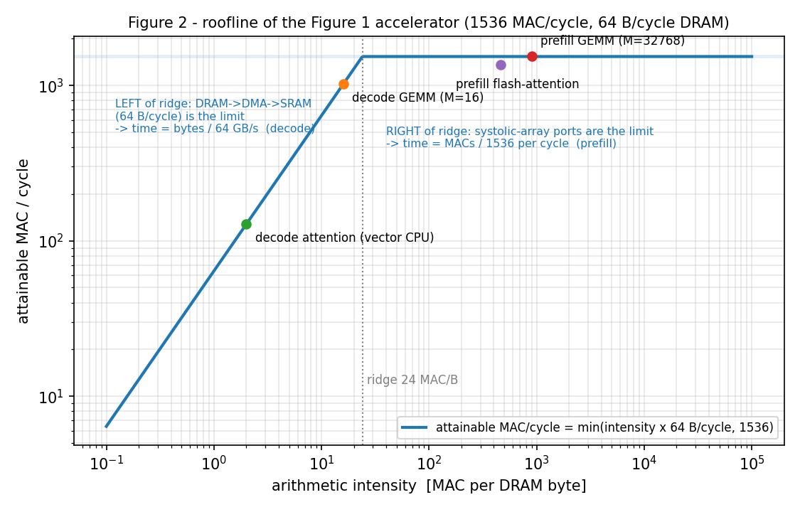

# Answers to section 2.2 — flash-attention kernel and Llama 3.1 8B inference on the Figure 1 accelerator

This report answers the five problems of section 2.2 in order, each under its own
heading with the problem statement quoted verbatim. Section 0 is not a sixth problem: it
establishes the two facts every answer rests on — what Figure 1 says about performance,
and that LLM inference has **two phases, prefill and decode, which behave in opposite
ways on this machine**. Each problem is therefore answered twice where it matters: once
for prefill, once for decode.

Every number is produced by `perf_model.py` (console log `model_output.txt`); the kernel
of problem 1 is `flash_attention_pseudocode.py` (Part A = prefill, Part B = decode).
Assumptions are numbered A1–A15 and listed in Appendix A.

---

## 0. Two things to establish before answering

### 0.1 What Figure 1 tells us about performance

Figure 1 is a block diagram of **data paths**. For performance analysis each arrow is a
pipe with a fixed bandwidth (parameter table), and the time a kernel takes is set by the
slowest pipe its bytes must go through. At 1 GHz, 1 cycle = 1 ns and bit/cycle ÷ 8 = GB/s:

| Arrow in Figure 1 | Given | bytes/cycle | Consequence |
|---|---|---|---|
| DRAM ↔ DMA engine | 512 bit/cycle | 64 | in series with the next arrow → **64 GB/s end-to-end**; every weight and KV-cache byte goes through it |
| DMA engine ↔ SRAM | 512 bit/cycle | 64 | (same path) |
| SRAM ↔ vector CPU | 1024 bit/cycle | 128 | infinite compute → its time is exactly bytes ÷ 128 |
| SRAM → 16×16 array (inputs) | 512 bit/cycle | 64 | |
| 16×16 array → SRAM (outputs) | 64 bit/cycle | **8** | only 4 int16 results per cycle |
| SRAM → 32×16 array (inputs) | 768 bit/cycle | 96 | |
| 32×16 array → SRAM (outputs) | 64 bit/cycle | **8** | |
| Host interface ↔ DRAM | — | — | the **only** external port: accelerators talk to each other only through the host |
| Control CPU → engines | 200 / 300 / 100 cycles | — | no data path, only command latency |

What follows from the figure:

**(a) Compute units never see DRAM.** Only the DMA reaches it; only the SRAM feeds the
arrays and the vector CPU. Every kernel is "DMA in → compute → DMA out", double-buffered
by the control CPU. → SRAM allocation strategy, problem 1.

**(b) The arrays are port-limited; the table gives their speed.** A tile op streams Aᵀ
and B (int8) in and C (int16) out; pipelined, so a tile costs
`max(input bytes / input bw, output bytes / output bw)` cycles (A2):

| Array | K | input cycles | output cycles | cycles/tile | MAC/cycle |
|---|---|---|---|---|---|
| 16×16 | 256 | (16+16)·256/64 = 128 | 16·16·2/8 = 64 | **128** | **512** |
| 16×16 | 128 | 64 | 64 | 64 | 512 |
| 32×16 | 256 | (32+16)·256/96 = 128 | 32·16·2/8 = 128 | **128** | **1024** |
| 32×16 | 128 | 64 | 128 | 128 | **512** — output-port bound |

Peak: 512 + 1024 = **1 536 MAC/cycle = 3.07 TOPS**. At K = 256 both arrays are balanced
(the constants were chosen for this); at K = 128 — the head dimension, i.e. the
contraction depth of Q·Kᵀ — the 32×16 array is output-bound and drops to half rate.
→ kernel design in problem 1, bottleneck in problem 2.

**(c) The arrays could ingest weights at 32 + 64 = 96 B/cycle** (weight tile = Aᵀ
operand, 16 or 32 rows of 256 B per 128 cycles), but DRAM delivers only 64 B/cycle. →
problems 3 and 4.

**(d) One ratio: 1 536 MAC/cycle ÷ 64 B/cycle = 24 MAC per DRAM byte** (the ridge
point). A kernel doing fewer MACs per byte it loads from DRAM is memory-bound (time =
bytes / 64 GB/s); more, and it is compute-bound (time = MACs / 1.536·10¹² s⁻¹).
Figure 2 (`roofline.png`) draws this: the sloped part is the DRAM limit, the flat part
the array limit, and the four dots are the four phases of the workload.



**(e) The control CPU is on no data path.** Its 200/300/100-cycle latencies must be
hidden by enqueueing commands ahead (A7), otherwise a 128-cycle tile preceded by a
100-cycle command would run at 56 %. → problem 1 (design rule), problem 2 (zero elasticity).

**(f) Accelerators communicate only through the host.** → problem 5.

### 0.2 The two phases of LLM inference on this machine

Generating a reply has two phases. **Prefill** processes the whole 2048-token prompt of
each sequence at once (16 × 2048 = 32 768 tokens go through every layer together) and
writes the KV cache; its duration is the **TTFT**. **Decode** then produces one token
per sequence per step, 256 times; each step reads *all* weights and the *whole* KV cache
again for only 16 tokens of work; the step time sets the **interactivity**. On the
Figure 1 machine these two phases land on opposite sides of the ridge of Figure 2:

| | **Prefill** (→ TTFT) | **Decode** (→ interactivity) |
|---|---|---|
| tokens per layer per pass | 32 768 | 16 (one per sequence) |
| GEMM: MACs per weight byte | 32 768 | 16 |
| attention: MACs per KV byte | ≈ 460 (K/V reused by 2048 queries × 4 heads) | ≈ 2 (K/V read once, used once) |
| regime (ridge = 24 MAC/B) | **compute-bound** | **memory-bound** |
| binding resource | SRAM ↔ systolic-array ports | DRAM → DMA → SRAM path (64 GB/s) |
| MACs per layer | 7.5·10¹² | 3.8·10⁹ |
| DRAM bytes per layer | ≈ 12 GB (weights once, 32 768-row activations in/out) — still only 4 % of the time | 218 MB weights + 143 MB KV (avg) — 100 % of the time |
| what the kernel must optimise | array utilisation | DRAM streaming efficiency; bytes per token |
| SRAM's role | hold reusable operands (weight slabs, int8 K/V) | small landing ring; nothing is reusable |
| systolic arrays | 100 % busy | 67 % on GEMMs, idle in attention |
| vector CPU | softmax, requantisation, fp32 accumulation | streams K/V once (decode attention runs here) |
| time per layer | 4.92 s | 5.5 ms |
| metric | **TTFT ≈ 157 s** | **≈ 189 ms/token → 5.3 tok/s per sequence** |

Because the two phases have different bottlenecks, the kernel (problem 1), the
bottleneck (problem 2), the performance model (problem 3), the improvements (problem 4)
and the parallelisation (problem 5) are each treated separately for prefill and decode.

**Workload sizes** (Llama 3.1 8B, A15; W8 A16; 16 × 2048 in / 256 out):
linear weights 6.98 GB int8 + LM head 0.53 GB → **7.50 GB streamed per decode step
(117 ms at 64 GB/s)**; KV cache 128 KiB per token → **4.56 GB read per decode step at
the average context of 2 176 (71 ms)**; prefill 2.29·10¹⁴ linear MACs → **149 s at
1 536 MAC/cycle**; prefill attention 9.9·10¹² MACs (4 % of prefill).

---

## Problem 1

> *Provide a pseudocode implementation of an optimized flash-attention kernel for this
> architecture, detailing the SRAM allocation strategy, the tiling strategy and the
> overall computation dataflow. Keep in mind that this code, once implemented, would be
> executed on the control CPU.*

The pseudocode is `flash_attention_pseudocode.py`. It is the program of the **control
CPU** (it programs DMA descriptors, enqueues tile commands, launches vector programs and
chains them with events) and has two entry points, because the two phases require two
different kernels:

| | **Part A — `flash_attention_prefill`** | **Part B — `flash_attention_decode`** |
|---|---|---|
| shape per (sequence, KV group) | 4 heads × 2048 queries × 2048 keys, causal | 4 heads × 1 query × L keys, L = 2049…2304 |
| MACs / DRAM bytes | 2.4 G / 5 MB (K, V once; Q in, O out for 4 heads) → 460 MAC/B, compute-bound | 2.2 M / 1.1 MB (K, V once) → 2 MAC/B, memory-bound |
| engines | both arrays (100 %) + vector CPU (38 %); DMA 5 % | DMA (100 %) + vector CPU (50 %); arrays idle |
| design objective | keep both arrays saturated | keep the DRAM pipe saturated |
| tiling | 128-query × 256-key blocks, 32-row sub-tiles | 256-key chunks of the KV stream |
| SRAM | 4.4 MiB: int8 K/Vᵀ resident per group, double-buffered Q/S/P/O | 0.8 MiB: 4-deep ring of 128 KiB chunks |
| time per layer | 226 ms | 2.2 ms |

### 1.A Prefill kernel (compute-bound)

**What it must do.** For one head: S = Q·Kᵀ (2048 × 2048, contraction over d = 128),
P = softmax(S) with causal mask, O = P·V (contraction over keys). Flash-attention
processes S block by block with an *online* softmax (running max m and sum l per row) so
that S is never fully materialised. Here the motive is not SRAM capacity (one head's S
in int16 is 8 MiB and would fit) but **bandwidth**: S leaves the arrays through an
8 B/cycle port and is read by the vector CPU, so it must be produced and consumed
exactly once.

Design goals in order: (1) both arrays busy 100 % of the time — they are the scarce
resource; (2) vector CPU off the critical path; (3) each K/V byte loaded from DRAM once
per layer and shared by the 4 query heads of the GQA group; (4) no control-CPU latency
ever stalls an engine.

**Mapping the two matmuls onto the two arrays.** The arrays compute C = AᵀB with both
operands stored as [rows × K] — "rows dot rows". So S = Q·Kᵀ uses query rows (128 B)
against key rows (128 B) with K = 128; O = P·V uses P rows (256 keys) against rows of
**Vᵀ** (256 keys) with K = 256. Vᵀ is built in SRAM once per (sequence, group) by the
vector CPU while it converts V to int8 (12 k cycles, amortised over 4 heads × 2048
queries); storing the cache transposed was rejected because the decode-time append
would become 128 scattered 2-byte writes.

Table (b) says: at K = 128 both arrays give 512 MAC/cycle, at K = 256 the 32×16 gives
1024. If the 32×16 array does all of P·V and a fraction x of Q·Kᵀ, the two arrays finish
together when (1−x)·W/512 = x·W/512 + W/1024 → **x = 0.25**:

- 16×16 array: 75 % of Q·Kᵀ;
- 32×16 array: 25 % of Q·Kᵀ + 100 % of P·V.

→ **1 365 MAC/cycle sustained = 89 % of peak** (`split_two_arrays` confirms the
optimum; proportional sharing would give 1 229, leaving the 32×16 idle during Q·Kᵀ 1 024).

**Tiling strategy.**

| Parameter | Value | Reason |
|---|---|---|
| Key block BC | **256** | = Kmax: one P·V tile op contracts a whole key block |
| Query block BR | **128 = 4 sub-tiles of 32** | 32 rows = 32×16 geometry; 4 sub-tiles balance the arrays: 3 S sub-tiles on the 16×16 = 1 S + 4 PV sub-tiles on the 32×16 |
| S sub-tile (32 q × 256 k) | 32 ops × 64 cyc (16×16) or 16 ops × 128 cyc (32×16) | 2 048 cycles either way |
| PV sub-tile (32 q × 128 d) | 8 ops × 128 cyc (32×16) | 1 024 cycles |
| one 128 × 256 block | **6 144 cycles on each array** | 16×16: 3 × 2 048; 32×16: 2 048 + 4 × 1 024 |
| vector-CPU bytes per block | 256 KiB → 2 048 cycles | 33 % of block time |
| causal skipping | 72 of 128 blocks per head | blocks above the diagonal not issued; diagonal blocks masked by the vector CPU |

**SRAM allocation strategy.** Anything reused across many tiles stays resident for as
long as it is reused (int8 K, Vᵀ per group; int8 Q per head); anything handed from one
engine to another is double-buffered so producer and consumer never wait:

| Region | Size | filled by → drained by | lifetime |
|---|---|---|---|
| KV staging ×2 (16-bit K, V of one group) | 2 × 1 MiB | DMA → vector CPU | one (sequence, group) |
| K8 [2048×128], Vᵀ8 [128×2048], scales | 524 KiB | vector CPU → arrays | one group, shared by 4 heads |
| Q staging ×2 (16-bit, one head) | 2 × 512 KiB | DMA → vector CPU | one head |
| Q8 ×2 [2048×128] + scales | 2 × 264 KiB | vector CPU → arrays | one head |
| S ×2 [128×256] int16 | 2 × 64 KiB | arrays → vector CPU | one key block |
| P8 ×2 [128×256] uint8 | 2 × 32 KiB | vector CPU → 32×16 | one key block |
| O partial ×2 [128×128] int16 | 2 × 32 KiB | 32×16 → vector CPU | one key block |
| O accumulator fp32, m/l/α | 66 KiB | vector CPU (RMW) | one query block |
| O out ×2 [128×128] int16 | 2 × 32 KiB | vector CPU → DMA | one query block |
| **Total** | **≈ 4.4 MiB of 16 MiB** | | |

The remaining ≈ 11.5 MiB lets the surrounding GEMMs keep an 8 MiB weight slab resident
(A9) and leaves head-room to prefetch the next group's K8/Vᵀ8.

**Computation dataflow.** Loop order: **(sequence b, KV group g) → head h → query block
qi → key block kj → sub-tile**. K/V are DMA'd and converted once per (b, g), Q once per
head; the next group's K/V and next head's Q are prefetched during compute (DMA 5 %
busy). Steady state for one key block, software-pipelined by one block:

```
cycle      0          2048         4096         6144
16×16   | S(sub0, j) | S(sub1, j) | S(sub2, j) |
32×16   | S(sub3, j) | PV(sub0, j−1) PV(sub1, j−1) PV(sub2, j−1) PV(sub3, j−1) |
vector  |   softmax(sub3, j)  softmax(sub0..2, j)   accumulate(sub0..3, j−1)    |  33 % busy
DMA     |   prefetch next Q / next K,V ;  write back finished O blocks           |   5 % busy
```

Per layer: 16 × 8 groups × 4 heads × 72 blocks × 6 144 cycles = **226 ms** (arrays
100 %, vector CPU 38 % including requantisation, DRAM 5 %).

**Numerics (A3, A4).** Operands fed to the arrays are requantised to int8 by the vector
CPU (Q, K per row; V per channel × 256-key block; P as uint8 with scale 1/255); output
right-shifts of 6 (Q·Kᵀ) and 8 (P·V) keep the sums in 16 bits; the vector CPU undoes
shifts and scales in fp32, applies 1/√d, the mask, exp, running max/sum, and accumulates
O in fp32. The rescale factor α = exp(m_old − m_new) is applied when the P·V partial of
the same block is folded in, so it costs no extra traffic.

### 1.B Decode kernel (memory-bound)

**Why a different program.** Per (sequence, group) and layer, decode attention is 4
query vectors (the 4 heads of the group, one new token) against L ≈ 2 176 keys and
values: 2.2 M MACs, but 1.1 MB of K/V that is read from DRAM **once and used once**.
Nothing can finish before the DMA has streamed those bytes: 1.1 MB / 64 B per cycle =
8·L cycles (17.4 k cycles per pair, 2.2 ms per layer for the 128 pairs). The question is
only which engine consumes the stream without slowing it:

- *Systolic arrays:* Aᵀ must be a 16-row tile but only 4 rows (the heads) are useful, so
  ≤ 25 % of the input port does work; K/V would also have to be requantised and V
  transposed **every step** (they are never reused), adding 1.6 MB of vector traffic per
  pair. Array time per pair: 136 ops × 64 + 68 ops × 128 = 17.4 k cycles on the 16×16 —
  equal to the DMA time, for more complexity and a precision loss.
- *Vector CPU (chosen, A10):* reads each K/V byte once through the widest port of the
  chip (4·L cycles = 50 % of the DMA time), in fp32, no requantisation, no transpose,
  and the arrays stay free for the GEMMs.

The design objective therefore **flips**: instead of keeping the arrays fed, the control
CPU must keep the **DMA queue from ever running dry**.

**Tiling strategy = chunking the stream.** CH = 256 keys per chunk (64 KiB of K +
64 KiB of V at 16-bit). DMA time per chunk 128 KiB / 64 = **2 048 cycles** (the
pace-setter); vector time per chunk 128 KiB / 128 = 1 024 cycles. Online softmax across
chunks for the 4 heads (m, l, o in fp32, 2 KiB). The new token's own k and v are taken
from SRAM where this layer's QKV GEMM produced them, not read back from DRAM (also
avoids a read-after-write hazard on the cache).

**SRAM allocation strategy.**

| Region | Size | purpose |
|---|---|---|
| KV ring ×4 (K‖V chunk, 16-bit) | 4 × 128 KiB | DMA landing ring, 3 chunks in flight |
| Q_ALL [16 × 4096] int16 | 128 KiB | output of the QKV GEMM (already resident) |
| KV_NEW (k, v of the new token) | 64 KiB | same GEMM |
| accumulators m, l, o for 4 heads, fp32 | 2 KiB | current pair |
| O_ALL [16 × 4096] int16 | 128 KiB | input of the O-projection GEMM |
| **Total** | **≈ 0.8 MiB** | remaining ≈ 15 MiB: weight slabs of the decode GEMMs |

**Computation dataflow.** For each (b, g) the DMA streams chunks 0…n−1 into the ring;
the vector CPU consumes them in order (s = q₄·Kᵀ, running softmax update,
o ← α·o + p·V), then folds the new token and writes o/l as int16 into the O-projection's
input buffer. The control CPU enqueues the descriptors of the next pair while the vector
CPU is still on the current one, so the ring is always three chunks ahead, and the first
weight slab of the following GEMM is queued behind the last KV chunk so the DRAM pipe
stays busy across the phase boundary:

```
cycle    0        2048      4096      6144      8192 …
DMA    | ch0      | ch1     | ch2     | ch3     | ch4 …   100 % busy
vector |          | ch0     | ch1     | ch2     | ch3 …    50 % busy
arrays |               idle (used by the GEMMs before and after)          |
```

Per layer: 128 pairs × 8.5 chunks × 2 048 cycles = **2.2 ms**, DRAM-bound.

---

## Problem 2

> *Identify and explain the bottleneck of this accelerator's architecture for the
> flash-attention kernel, i.e. the parameter with the largest elasticity with respect to
> time required for this kernel to complete.*

**Elasticity** e(p) = (ΔT/T)/(Δp/p) is the percentage change in kernel time per
percentage change in a table parameter: −1 means time is inversely proportional to p
(p *is* the bottleneck), 0 means p is irrelevant. Each parameter was scaled by ±10 % in
the model and T re-evaluated; series links and array ports are also scaled as groups.
The answer is different for the two phases, because the kernels are different:

| Parameter of the table | **prefill kernel** | **decode kernel** | (whole prefill) | (whole decode step) |
|---|---|---|---|---|
| DRAM ↔ DMA ↔ SRAM path (both links) | 0.00 | **−1.01** | 0.00 | **−1.01** |
| one DRAM link alone | 0.00 | −0.55 | 0.00 | −0.55 |
| SRAM ↔ systolic-array bandwidth (all 4 ports) | **−1.01** | 0.00 | **−1.00** | 0.00 |
| ↳ the two 64 bit/cycle *output* ports | **−0.64** | 0 | −0.37 | 0 |
| ↳ the two input ports | −0.46 | 0 | −0.70 | 0 |
| ↳ 32×16 output port alone (largest single parameter) | −0.34 | 0 | −0.35 | 0 |
| SRAM ↔ vector CPU bandwidth | 0.00 | 0.00 | −0.01 | 0.00 |
| control-CPU latencies (200/300/100) | 0.00 | 0.00 | 0.00 | 0.00 |
| DRAM read/write latency | 0.00 | 0.00 | 0.00 | 0.00 |

### 2.A Prefill: the SRAM ↔ systolic-array bandwidth, specifically the 64 bit/cycle output ports

Kernel time is exactly inversely proportional to the array-port bandwidth (−1.0). The
output ports carry the larger share (−0.64) for a structural reason from table (b):
Q·Kᵀ contracts over only d = 128, so a 32×16 tile loads in 64 cycles but drains in 128
through an 8 B/cycle port — the array waits on its output half the time — and the 16×16
array at K = 128 is exactly balanced, so its output port matters as much as its input.
The single most elastic scalar parameter is the 32×16 array's output bandwidth (−0.34).
Everything else has slack: vector CPU 38 %, DRAM 5 %; the control latencies have zero
elasticity *because* commands are queued (A7) — without queueing, a 100-cycle wait per
128-cycle tile would make them the bottleneck (peak 862 instead of 1 536 MAC/cycle,
476 ms instead of 226 ms per layer).

### 2.B Decode: the DRAM → DMA → SRAM path

9·10⁹ MACs move 4.6 GB per step; the kernel is a pure stream (−1.0 on the DRAM path),
the vector CPU is half idle and the arrays are not involved. Either link alone has
elasticity −0.55: widening one without the other is useless, they are in series. The
right-hand columns show that the same two parameters govern the complete model: prefill
−1.0 on array ports, decode −1.0 on DRAM.

---

## Problem 3

> *Provide estimations of the TTFT (time to first token) and the interactivity (token
> generation rate) for this workload and architecture. These numbers must be justified by
> a performance model which takes into account the architectural constants detailed above.*

TTFT is the prefill time; interactivity is 1 / (decode step time). The two are modelled
with the same machinery but reduce to different formulas.

### 3.1 The performance model (`perf_model.py`)

- **Pipes.** DMA path 64 B/cycle, the two arrays (table (b)), vector CPU 128 B/cycle.
  Time on a pipe = bytes ÷ bandwidth. One 800-cycle fill cost per phase for the command
  and DRAM latencies (A7).
- **Phases.** A layer = QKV projection, attention, O projection, gate+up, down,
  element-wise (RoPE, residuals, SwiGLU). Inside a phase the pipes run concurrently
  (double buffering, A13): phase time = max(array, DRAM, vector) + fill. Phases are
  serialised.
- **GEMM dataflow, prefill (weights stationary):** an 8 MiB weight slab stays in SRAM
  while the M = 32 768-row int8 activation matrix streams past it and is re-read once per
  slab (A9); both arrays work on disjoint output tiles. The vector CPU requantises the
  input and accumulates the 16-bit partial tile of every 256-deep K-chunk into fp32 (A4).
  → time = MACs / 1 536 per cycle; DRAM and vector have slack.
- **GEMM dataflow, decode (activations stationary):** the [16 × K] int8 activation is
  one B tile and stays resident; the weights stream through once, split by output column
  between the arrays; the vector CPU accumulates K-chunks as before. → time = weight
  bytes / 64 B per cycle; the arrays are 67 % busy (16 MAC/B against the 24 MAC/B ridge).
- **Attention:** the kernels of problem 1, Part A for prefill, Part B for decode.
- **Totals.** Prefill = 32 layers at M = 32 768 + LM head on the 16 last tokens. Decode
  step = 32 layers at M = 16 + LM head, evaluated at every context from 2049 to 2304.

### 3.2 Prefill → TTFT

One layer at M = 32 768 tokens:

| Phase | time | array | DRAM | vector | bound by |
|---|---|---|---|---|---|
| QKV projection | 537 ms | 537 | 21 | 264 | arrays |
| flash-attention (Part A) | 226 ms | 226 | 10 | 87 | arrays |
| O projection | 358 ms | 358 | 15 | 177 | arrays |
| gate + up | 2 505 ms | 2 505 | 67 | 1 222 | arrays |
| down | 1 253 ms | 1 253 | 79 | 605 | arrays |
| element-wise | 36 ms | – | – | 36 | vector |
| **per layer** | **4 916 ms** | | | | |

**TTFT ≈ 32 × 4.916 s + 8 ms = 157 s** for the batch of 16 prompts. In closed form:
TTFT ≈ MACs / (1 536 MAC/cycle × 10⁹) = 2.29·10¹⁴ / 1.536·10¹² = 149 s, plus 5 % of
kernel inefficiency (attention at 89 % of peak, K-chunk overheads). It is 99 % array
time: the vector CPU is at ≈ 49 % (mostly the fp32 accumulation forced by A4), DRAM at
3–6 %. Since prefill is compute-bound with no dependence between prompts, prefilling
them one after another gives the first user a TTFT of ≈ 10 s and the last ≈ 157 s at no
cost in total time.

### 3.3 Decode → interactivity

One layer at context 2049:

| Phase | time | array | DRAM | vector | bound by |
|---|---|---|---|---|---|
| QKV projection | 0.40 ms | 0.26 | 0.39 | 0.13 | DRAM |
| attention (Part B, vector CPU) | 2.10 ms | – | 2.10 | 1.05 | DRAM |
| O projection | 0.26 ms | 0.17 | 0.26 | 0.09 | DRAM |
| gate + up | 1.84 ms | 1.22 | 1.84 | 0.60 | DRAM |
| down | 0.92 ms | 0.61 | 0.92 | 0.30 | DRAM |
| element-wise | 0.02 ms | – | – | 0.02 | vector |
| **per layer** | **5.53 ms** | | | | |

In closed form the step is a byte count over the DRAM path:

**T_step(L) ≈ (7.50 GB weights + 16 × L × 128 KiB KV) / 64 GB/s = 117 ms + 0.033 ms × L**

→ 185 ms at L = 2049 (first token), **189 ms at the average L = 2176**, 194 ms at
L = 2304 (last token). **Interactivity ≈ 5.3 tokens/s per sequence, 84.5 tokens/s
aggregate.** 62 % of a step streams weights, 38 % streams KV cache; the arrays are 67 %
busy on GEMMs and idle during attention. End-to-end: 157 s + 256 × 0.189 s ≈ 206 s.

### 3.4 Dependence on the assumptions

| Assumption changed | TTFT (prefill) | interactivity (decode) |
|---|---|---|
| A2: arrays PE-bound (1 MAC/PE/cycle) instead of port-bound | 315 s (×2) | unchanged |
| A3: exact 16-bit activations via hi/lo-byte split | 328 s (×2.1) | unchanged |
| A7: tile commands not queued | ≈ ×1.6 | 211 ms/token (−10 %) |

The array assumptions move TTFT by up to 2× and interactivity not at all, because decode
never touches the array limit. Neither changes which resource is the bottleneck.

---

## Problem 4

> *Suggest 2 architectural improvements to the accelerator that would improve the
> interactivity.*

Interactivity is a **decode** metric, so the improvements must attack the decode
bottleneck, and 3.3 gives it in one line: T_step = (weight bytes + KV bytes) / DRAM-path
bandwidth. The two levers are the denominator and the numerator. The model quantifies
both, shows what binds next, and — because the phases differ — also records the effect
on prefill/TTFT.

| Variant | decode step | tok/s per seq | aggregate | then bound by | TTFT |
|---|---|---|---|---|---|
| baseline (Figure 1 as given) | 189 ms | 5.3 | 84.5 | DRAM path | 157 s |
| **1.** DRAM ↔ DMA ↔ SRAM path ×4 (256 GB/s) | 115 ms | **8.7** | 140 | array input ports (weights), vector port (KV) | 157 s (unchanged) |
| 1′. same, ×8 | 115 ms | 8.7 | 140 | unchanged — DRAM no longer the limit | 157 s |
| **2.** int4 weights + int8 KV cache, de-quantised in the DMA engine | 115 ms | **8.7** | 140 | array input ports | 157 s (unchanged) |
| 1 + 2 | 97 ms | 10.3 | 165 | array input ports | 157 s |
| 1 + 2 + array and vector ports ×2 | 49 ms | 20.6 | 330 | arrays | ≈ 79 s |

**Improvement 1 — widen the memory path (DRAM ↔ DMA ↔ SRAM).** The parameter with
elasticity −1 in decode (2.B). Replacing the two 512-bit interfaces by an HBM-class
path (4–8×) cuts the step from 189 to 115 ms (+65 %). Both links must be widened
together (the −0.55 single-link elasticities). Beyond ≈ 1.5× the arrays' 96 B/cycle
weight ingest (0.1 (c)) and the vector CPU's 128 B/cycle KV ingest become the limit, so
×4 and ×8 are identical. Prefill is untouched: it never used the DRAM path.

**Improvement 2 — move fewer bytes per token: hardware de-quantisation of int4 weights
and int8 KV cache in the DMA engine.** Weight traffic halves (7.5 → 3.75 GB per step),
KV traffic halves (4.6 → 2.3 GB), and the arrays and vector CPU still see int8 / int16 in
SRAM, so the kernels of problem 1 are unchanged. Alone it also gives 115 ms (weights then
hit the array input ports); with improvement 1 it reaches 97 ms (+95 %). KV compression
is an accuracy trade against the 16-bit activation spec and must be validated; int4
weights are standard practice for Llama-class models. Prefill is again unchanged.

Not counted as the two, but rated by the model as the next steps: 32-bit in-array
accumulation across K-chunks (removes 47 % of vector traffic in GEMMs and the 16-bit
partial-sum rounding); wider array ports or a third array — this is the *only* kind of
change that improves TTFT, because prefill is array-bound; direct accelerator-to-
accelerator links (problem 5). A larger SRAM does **not** help decode: neither 7.5 GB of
weights nor 4.8 GB of KV can become resident, and the decode kernels use < 1 MiB.

---

## Problem 5

> *Suppose that 4 such accelerators can be connected to a single host CPU.*

### 5.1 — *How would you parallelize the computation of this workload across the 4 accelerators?*

The two phases want different partitions, so the plan is **data-parallel prefill, then
tensor-parallel decode**, with one re-shard of the KV cache in between.

**Decode (interactivity).** The step time is bytes per accelerator per token (3.3), so
the weights *and* the KV cache must be split, not the batch:

| Scheme | weights / acc. / step | KV / acc. / step | step | tok/s per seq | communication per step |
|---|---|---|---|---|---|
| Pipeline (8 layers each) | 1.9 GB | 1.1 GB | **189 ms** — stages run in sequence | 5.3 | 3 × 128 KiB |
| Data (4 sequences each) | 7.5 GB | 1.1 GB | 135 ms | 7.4 | none |
| **Tensor, TP = 4** | 1.9 GB | 1.1 GB | **48 ms** | **21.0** | 64 all-reduces × 128 KiB |

Pipeline parallelism multiplies throughput but not interactivity (a token still waits
for all 32 layers of weight streaming); data parallelism only removes the KV share.
**Tensor parallelism is used for decode**: each accelerator owns 8 query heads and 2 KV
heads (the GQA groups split cleanly, so the Part B kernel runs unchanged on its own
groups), one quarter of each FFN matrix (column-split gate/up, row-split down) and one
quarter of the vocabulary. Two all-reduces per layer — after the O projection and after
the down projection — of 16 × 4096 × 2 B = 128 KiB each, plus a tiny arg-max exchange for
the split LM head. Because the accelerators only see the host (0.1 (f)), each all-reduce
is: every accelerator sends 128 KiB up, the host sums, and sends 128 KiB back (A12).

**Prefill (TTFT).** The same TP sharding would give 39.6 s of compute but each all-reduce
is then 256 MiB per accelerator and the 64 of them cost 42 s at the bandwidth of 5.3 —
doubling TTFT. Prefill is compute-bound with no dependence between prompts, so it runs
**data parallel: 4 prompts per accelerator with the full model, 39.3 s, zero
communication**. The Part A kernel runs unchanged.

**Transition.** After prefill each accelerator holds the complete KV cache of its 4
sequences; decode needs each to hold 2 KV heads of all 16. Each accelerator sends 3/4 of
its 1 GiB through the host once: ≈ 1 s at the bandwidth of 5.3. TTFT for the batch drops
from 157 s to ≈ 40 s.

### 5.2 — *What is the theoretical maximum interactivity that can be achieved by this system?*

With communication free, the TP = 4 decode step is 1.9 GB of weights + 1.1 GB of KV
through one 64 GB/s DRAM path = **47.6 ms** (still DRAM-bound: array ingest would allow
19 ms, vector KV ingest 9 ms). Hence

**≈ 21 tokens/s per sequence (47.6 ms per token), 336 tokens/s aggregate** — the four
DRAM interfaces used perfectly in parallel, 4× the single accelerator.

### 5.3 — *What is the minimum required data bandwidth between the host CPU and the 4 accelerators to achieve 70 % of the theoretical maximum interactivity?*

70 % of 21.0 tok/s = 14.7 tok/s ⇒ the step may take 47.6 / 0.7 = 68.0 ms ⇒ the
communication budget is 68.0 − 47.6 = 20.4 ms for 64 all-reduces ⇒ **319 µs per
all-reduce**, during which 128 KiB goes up and 128 KiB comes back on each accelerator's
link, sequentially (the host cannot answer before all four partials have arrived):

**B_link ≥ 2 × 128 KiB / 319 µs ≈ 0.82 GB/s per accelerator (≈ 6.6 Gbit/s), i.e.
≈ 3.3 GB/s aggregate at the host** — roughly a PCIe 3.0 ×4 link per accelerator.

Sensitivities: 90 % of the maximum needs 3.2 GB/s per accelerator; 5 µs / 20 µs of
per-transfer latency raises the 70 % requirement to 0.85 / 0.94 GB/s; 32-bit instead of
16-bit partial sums doubles it to 1.65 GB/s. Because the model serialises each all-reduce
with the weight stream (A12), these are conservative: prefetching the next weight slab
(≤ 8 MiB, 0.13 ms) during each all-reduce would recover up to ≈ 8 ms per step. The
prefill phase needs no host bandwidth beyond the one-off 1 GiB re-shard.

---

## Appendix A — Assumptions

- **A1** Single 1 GHz clock; "bidirectional" links are full-duplex at the stated rate in each direction; no SRAM bank conflicts or bus contention (given).
- **A2** Array throughput is set by its SRAM ports (0.1, table (b)); implies 2 MACs per PE per cycle at K = 256. If PE-bound instead (1 MAC/PE/cycle, K cycles per tile), compute-bound numbers double (TTFT ≈ 315 s); decode unaffected.
- **A3** Operands fed to the arrays are dynamically requantised to int8 (per-row scales for Q, K, P and GEMM inputs; per-(channel, 256-key block) for V); 16-bit kept for storage, residual stream, softmax statistics and KV cache. Exact alternative (hi/lo-byte split) doubles TTFT to ≈ 328 s, decode unchanged.
- **A4** Array outputs are int16 with a programmable right shift; the arrays cannot accumulate into an existing C tile, so partial sums over 256-deep K-chunks are accumulated in fp32 by the vector CPU.
- **A5** Tile commands take (base, row stride) for A, B and C.
- **A6** DMA descriptors are queued and support 2-D strided copies; DRAM latency paid once per descriptor, overlapped by the queue.
- **A7** The control CPU issues commands asynchronously into FIFOs; latencies are pipeline-fill costs paid once per burst. Without queueing, peak would fall to 862 MAC/cycle.
- **A8** Vector CPU: infinite compute (given), fp32 arithmetic, cost = bytes ÷ 128. RMSNorm fused into the requantisation pass before each GEMM.
- **A9** Prefill GEMMs: 8 MiB weight slab resident in SRAM, int8 activation copy re-read once per slab. Decode GEMMs: [16 × K] activation resident, weights streamed once.
- **A10** Decode attention runs on the vector CPU, not the arrays (1.B).
- **A11** KV cache 16-bit (spec), token-major [tokens × 128] for K and V, in DRAM. Weights int8, stored transposed [N × K].
- **A12** Accelerators communicate only through the host; all-reduces host-mediated, on the critical path, full-duplex links, negligible host arithmetic.
- **A13** Within a phase DMA, arrays and vector CPU overlap perfectly (double buffering); phases in a layer are serialised.
- **A14** Greedy sampling; embedding lookup is a DMA gather — both negligible.
- **A15** Llama 3.1 8B: 32 layers, d = 4096, 32 query / 8 KV heads of 128, FFN 14 336 (SwiGLU), vocabulary 128 256, untied LM head → 8.03 B parameters.

## Appendix B — Files and reproduction

| File | Content |
|---|---|
| `flash_attention_pseudocode.py` | Problem 1: control-CPU pseudocode — Part A prefill kernel, Part B decode kernel — with runtime API, numerics, tiling, SRAM maps and schedules in the header |
| `perf_model.py` | Problems 2–5: the performance model. `python3 perf_model.py --json results.json --plot` reproduces every number and Figure 2 |
| `model_output.txt`, `results.json` | console log and raw results |
| `roofline.png` | Figure 2 |
| `README.md` | build / run instructions |

## Appendix C — Limitations

The model is analytical, not cycle-accurate: perfect overlap inside a phase and no
overlap between phases are approximations in opposite directions; the next step would be
a discrete-event simulation of the pseudocode's command streams to validate the
6 144-cycle prefill block schedule, the decode ring depth, and the buffer sizes. The
quantisation error of the int8 array boundary in prefill (A3) has not been evaluated
numerically and needs a calibration run on the real model. The 16-bit partial-sum output
of the arrays (A4) is a precision risk for the 256-deep FFN sums; fp32 accumulation on
the vector CPU limits it to per-chunk rounding.
